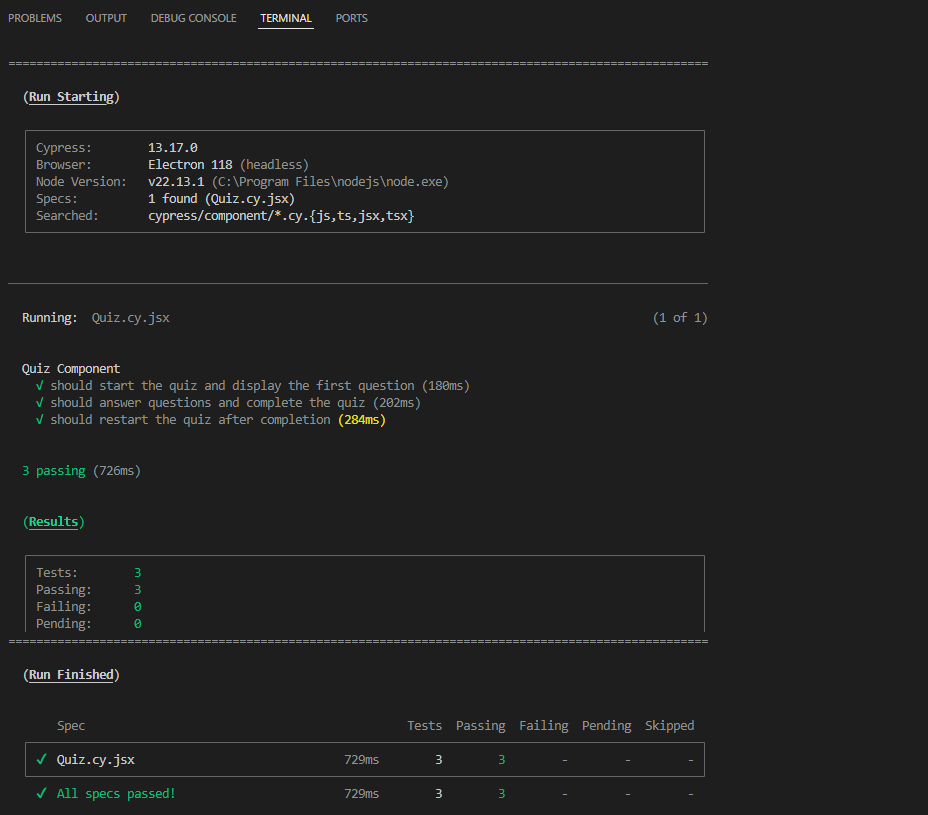
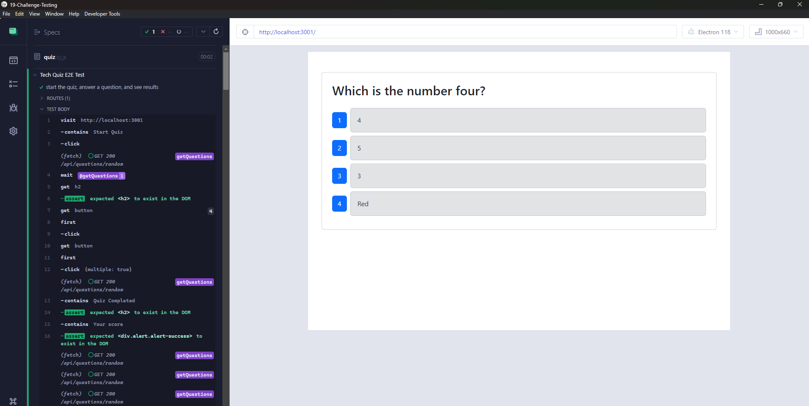

# 19-Challenge-Testing

## Description
AS AN aspiring developer I WANT to take a tech quiz SO THAT I can test my knowledge and improve my skills.

## Installation

All that is needed is running npm i.

## Usage

The application is a coding quiz, so you just click Start Quiz and answer the questions. The real part of the activity is confirming that the cypress test all work as expected and test all pass. To start the application from a terminal run "npm run start:dev" then open a second terminal and run "npm run test"

*This is a screenshot of the successful run of component test.*

*This is a screenshot of the successful run of the e2e test.*

[Link to Walkthrough Video](https://drive.google.com/file/d/1i9l-8K_MpPWlC0x-w2qLqcTCCCElWODJ/view?usp=sharing)
